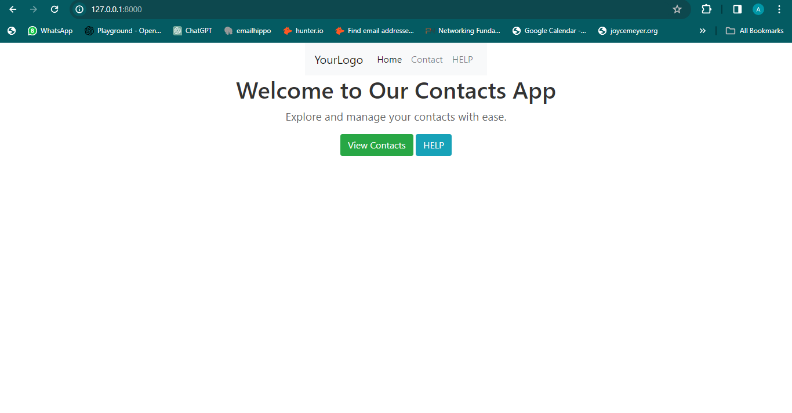
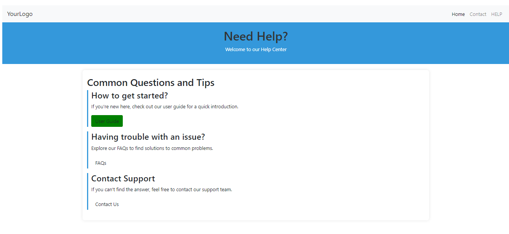
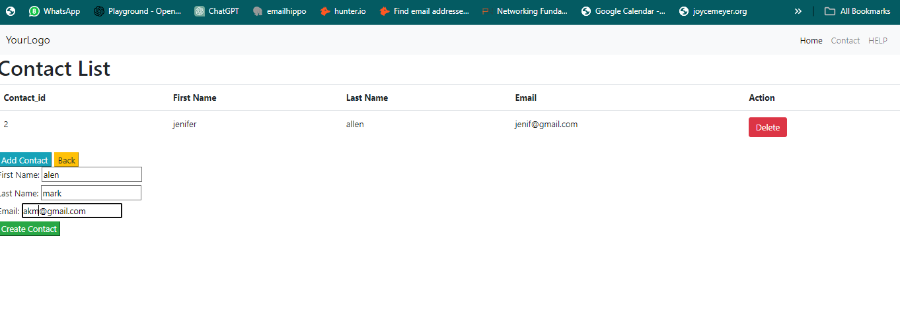

# Lab-4

1. Build a Django contacts app from scratch.
2. Start your project.
```bash
django-admin startproject WEBPROJECT
```
3. Create your app. Name it as you like.
```bash
python manage .py startapp webapp 
```
then create a virtual environment 
```bash
python -m venv myvenv

```
4. Create your templates folder. under the web app directory 
```bash
mkdir templates 
```


5. update the installed app with my web app in the installed apps 
```python
INSTALLED_APPS = [
    # ... other apps
    'webapp',
]
```
6. Update your models.py to include the contact models and add `__str__ method` to display the first and last name of the contact 
```python 
from django.db import models

# Create your models here.

class Contacts(models.Model):
    contact_id = models.AutoField(primary_key=True)
    first_name = models.CharField(max_length=255)
    last_name = models.CharField(max_length=255)
    email = models.EmailField(max_length=255)

    def __str__(self):
      return f"{self.first_name} {self.last_name}"


```
8. Update your views.py to include html files using the render function in django
```python

from django.shortcuts import render,redirect 
from .models import Contacts

from django.shortcuts import render

def home(request):

    return render(request, 'index.html')


```

9. Update urls.py in the project to include the urls on your app using the include function
   **create a file urls.py under the webapp application** and add the urls of the app
   ```python
   from django.urls import path
   from . import views

   urlpatterns = [
    path('', views.home, name='home'),
    path('contacts/', views.contacts, name='contacts'), 
    path('help/', views.help_page, name='help'),
    path('delete_contact/<int:contact_id>/', views.delete_contact, name='delete_contact'),

     ]

     ```

11. Do the migration. Necessary updates for the database.

```bash 
python manage.py makemigrations
```
```bash 
python manage.py migrate
```
12. Do the necessary updates to be able to use the admin interface
```python 
from django.contrib import admin
from .models import Contacts
# Register your models here.
admin.site.register(Contacts)
```
13. Add a couple of contacts using admin interface
14. Update your index.html, help.html and contacts.html
    1. Get creative.
15. Display those files
    1. localhost:8000/ (for index.html)

        

    2. localhost:8000/help/

         

    3. localhost:8000/contacts/

       

        **Display of the contacts**
        

        **Deleting a contact**

        

        **adding A Contact**
        

        
16. Add screenshots for each of the steps into your repository

18. Update the **readme file** by answering the following questions and typing your answers in that file.
    1. Explain your steps and include screenshots if needed.
19. Submit your repository via github.
